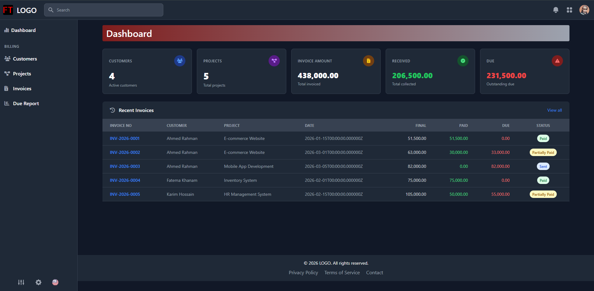
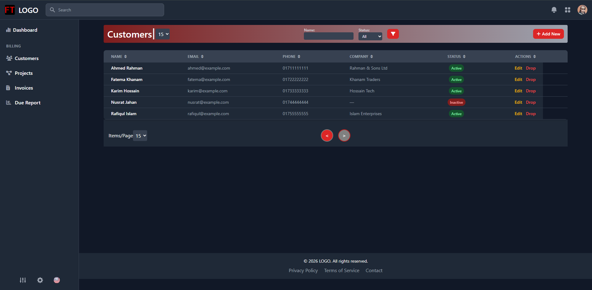
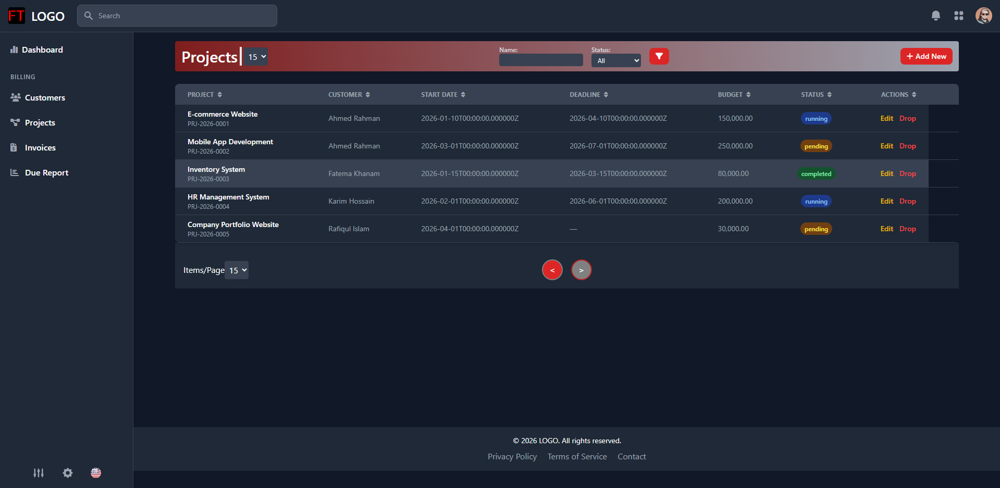
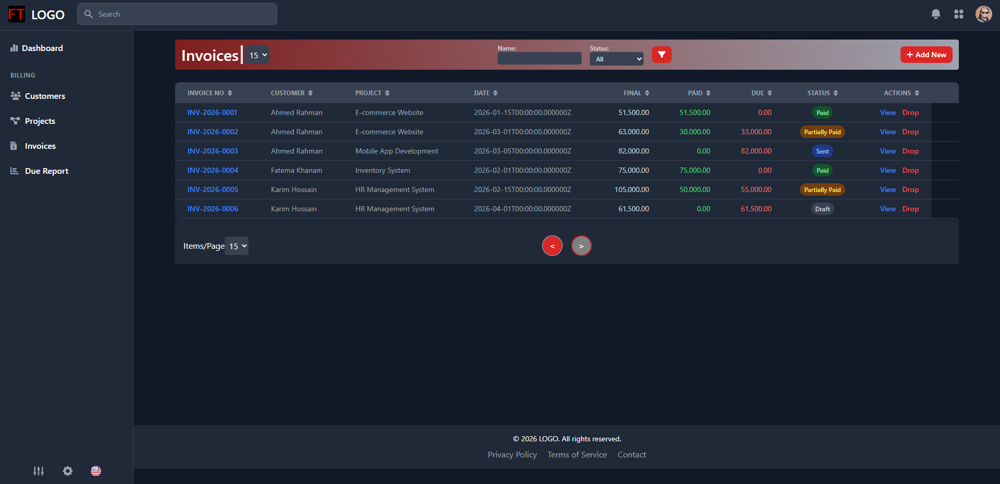

# FunTan — Billing & Project Management System

A full-stack billing and project management application built with **Laravel 9**, **Vue 2**, and **Tailwind CSS**. It features a Vue SPA admin dashboard for managing customers, projects, invoices, and payments, with a separate Laravel-rendered frontend.

<!-- #### Dashboard -->

<!-- #### Customers

#### Projects
 -->
#### Invoices


---

## Tech Stack

| Layer | Technology |
|---|---|
| Backend | Laravel, PHP 8.0+ |
| Frontend (Admin) | Vue 2, Vuex, Vue Router |
| Frontend (Public) | Blade templates, Tailwind CSS |
| Database | MySQL |
| Auth | Laravel Session Auth |
| Build Tools | Laravel Mix, Vite |
| UI Libraries | Flowbite, ApexCharts, SweetAlert2, Font Awesome |

---

## Features

- **Authentication** — Register, login, logout with role-based access
- **Customer Management** — Create, update, deactivate customers
- **Project Management** — Assign projects to customers, track budget and deadlines
- **Invoice Management** — Generate invoices per project, manage statuses (Draft → Sent → Partially Paid → Paid → Cancelled)
- **Payment Tracking** — Record payments against invoices (Cash, Bank Transfer, Mobile Banking), auto-updates invoice paid amount and status
- **Due Report** — View all outstanding/partially paid invoices
- **Dashboard** — Overview stats and charts

---

## Requirements

- PHP >= 8.0
- Composer
- Node.js >= 16 & npm
- MySQL

---

## Installation

### 1. Clone the repository

```bash
git clone <repo-url>
cd fun-tan
```

### 2. Install PHP dependencies

```bash
composer install
```

### 3. Install Node dependencies

```bash
npm install
```

### 4. Configure environment

```bash
cp .env.example .env
php artisan key:generate
```

Update your `.env` with database credentials:

```env
DB_CONNECTION=mysql
DB_HOST=127.0.0.1
DB_PORT=3306
DB_DATABASE=funtan
DB_USERNAME=root
DB_PASSWORD=your_password
```

### 5. Run migrations and seed

```bash
php artisan migrate --seed
```

> **Note:** If you get MySQL error 1701 (foreign key constraint on truncate), run `migrate:fresh` instead:
> ```bash
> php artisan migrate:fresh --seed
> ```

### 6. Build frontend assets

```bash
# Admin Vue app (Laravel Mix)
npm run watch

# Public frontend (Vite)
npm run dev
```

For production:

```bash
npm run build
```

### 7. Serve the application

```bash
php artisan serve
```

Visit [http://localhost:8000](http://localhost:8000) — you will be redirected to `/admin/dashboard`.

---

## Default Credentials

After seeding, log in with any user created via `/admin/register`.

---

## Project Structure

```
app/
├── Http/
│   ├── Controllers/       # Auth, Customer, Project, Invoice, Payment, Dashboard, Report
│   ├── Requests/          # Form request validation per resource
├── Models/                # Customer, Project, Invoice, Payment, User, Role
├── Services/              # InvoiceService, PaymentService, ProjectService
├── Supports/              # Helper utilities (BaseCrudHelper, GlobalHelper, etc.)
database/
├── migrations/            # All table definitions
├── seeders/               # RolesTableSeeder, CustomerSeeder, ProjectSeeder, InvoiceSeeder, PaymentSeeder
resources/
├── views/                 # Blade templates (login, register, frontend pages)
├── vue-app/
│   ├── backend/           # Admin SPA (Vue 2 + Vuex + Vue Router)
│   └── frontend/          # Public-facing Vue components
routes/
├── api.php                # REST API routes (no auth middleware — add as needed)
└── web.php                # Web routes (login, register, SPA catch-all)
```

---

## API Endpoints

All API routes are prefixed with `/api`.

### Dashboard
| Method | Endpoint | Description |
|--------|----------|-------------|
| GET | `/api/dashboard` | Summary stats |

### Customers
| Method | Endpoint | Description |
|--------|----------|-------------|
| GET | `/api/customers` | List all customers |
| POST | `/api/customers` | Create customer |
| GET | `/api/customers/{id}` | Get customer |
| PUT | `/api/customers/{id}` | Update customer |
| DELETE | `/api/customers/{id}` | Delete customer |

### Projects
| Method | Endpoint | Description |
|--------|----------|-------------|
| GET | `/api/projects` | List all projects |
| POST | `/api/projects` | Create project |
| GET | `/api/projects/{id}` | Get project |
| PUT | `/api/projects/{id}` | Update project |
| DELETE | `/api/projects/{id}` | Delete project |

### Invoices
| Method | Endpoint | Description |
|--------|----------|-------------|
| GET | `/api/invoices` | List all invoices |
| POST | `/api/invoices` | Create invoice |
| GET | `/api/invoices/{id}` | Get invoice |
| PUT | `/api/invoices/{id}` | Update invoice |
| DELETE | `/api/invoices/{id}` | Delete invoice |
| PATCH | `/api/invoices/{id}/cancel` | Cancel invoice |

### Payments
| Method | Endpoint | Description |
|--------|----------|-------------|
| POST | `/api/payments` | Record a payment |
| DELETE | `/api/payments/{id}` | Delete a payment |

### Reports
| Method | Endpoint | Description |
|--------|----------|-------------|
| GET | `/api/reports/due` | Due/outstanding invoice report |

---

## Invoice Statuses

| Status | Description |
|--------|-------------|
| `draft` | Created but not sent |
| `sent` | Sent to customer, no payment yet |
| `partially_paid` | Some amount paid |
| `paid` | Fully paid |
| `cancelled` | Cancelled, no further payments allowed |

---

## Payment Methods

| Value | Label |
|-------|-------|
| `cash` | Cash |
| `bank` | Bank Transfer |
| `mobile_banking` | Mobile Banking |

---

## Database Schema

```
customers
    └── projects (customer_id)
            └── invoices (project_id)
                    └── payments (invoice_id)
```

---

## License

MIT